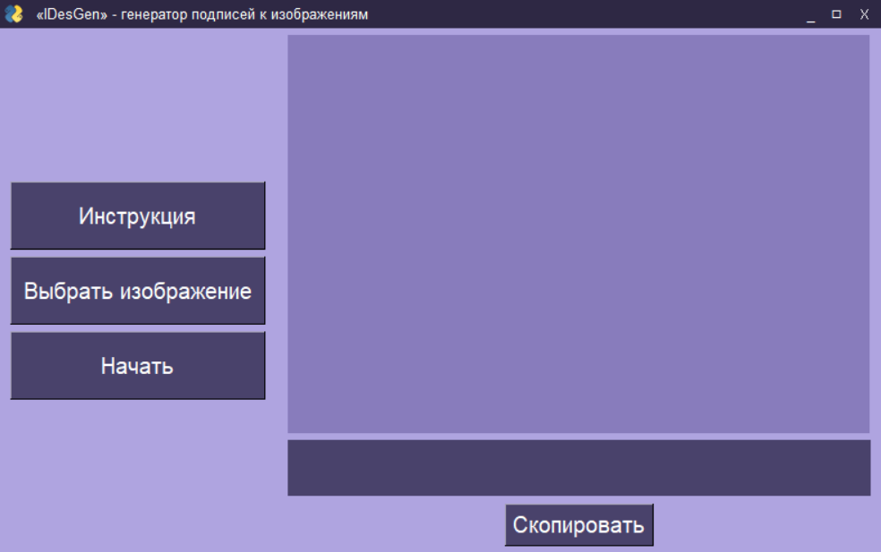
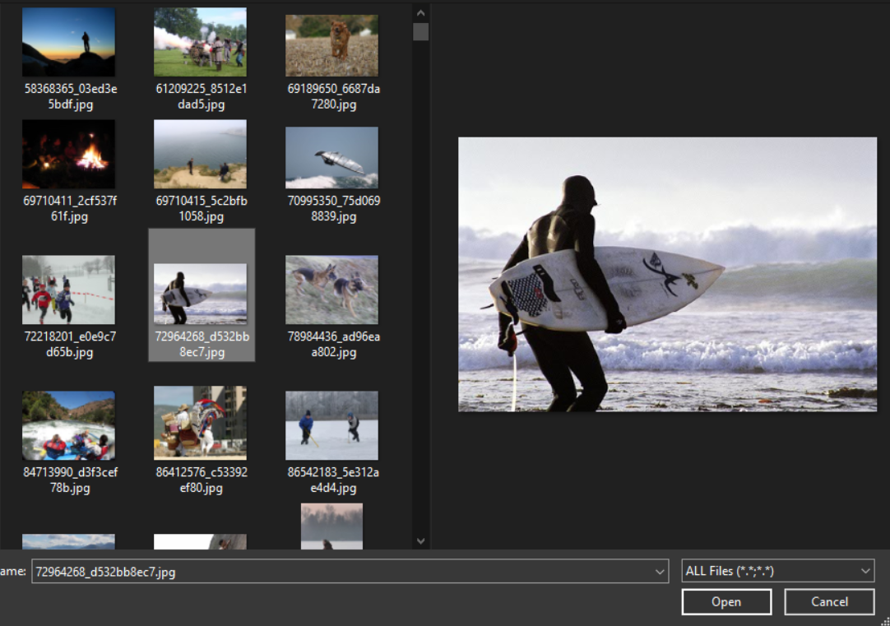
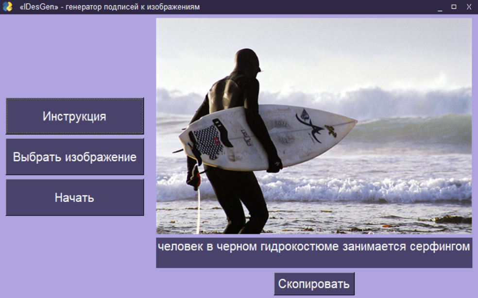

## Image caption generator "IDesGen"
Image caption generator on Python with GUI and Sqlite3 supported. 

This project served as the topic for a thesis. "IDesGen" stands for "Image Description Generator". Not bad, am I right?😊

Below are screenshots of the actual program:







### How to start an app
Requirements:
Python 3.10
You can install my used modules with:
```
pip install misc/requirements.txt
```
Now you should be OK!